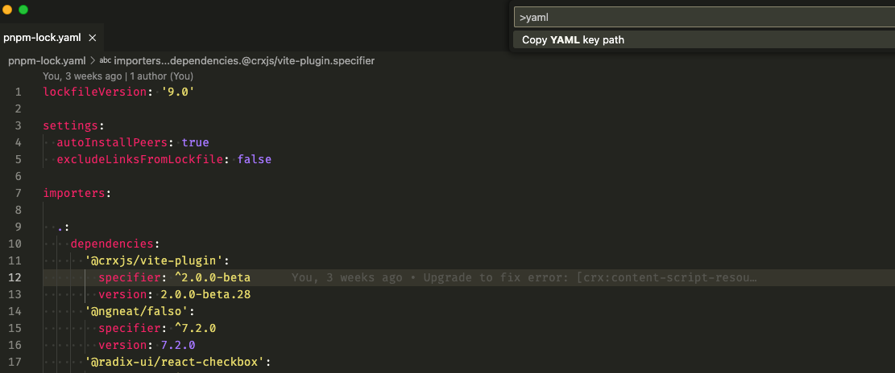

# yaml-symbols README

Display all key paths as symbols in YAML files

## Features

Show key path as symbols in outline window.

Open Symbol window to search.

Copy current key Path

## Extension Settings

1. Show leaf node only.
2. Ignore root key. Hide root key for sepcific files. You can add file patterns from [minimatch](https://github.com/isaacs/minimatch)

## Known Issues

None

## Release Notes

### 0.0.1

First release

**Enjoy!**
