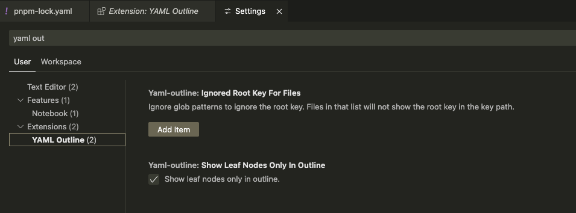

# YAML Outline Extension

Enhance your YAML editing experience with improved symbol navigation and key path management.

## Features

### Outline View

- Display all key paths as symbols in the outline window
- Quickly navigate through complex YAML structures


### Quick Search

- Search for symbols across your YAML files
- Fast navigation to specific keys


### Status Bar Integration

- Display the current key path in the status bar
- Click to copy the current key path
- Real-time updates as you navigate through the file


### Key Path Management

- Copy the current key path with a single command
- Easily reference and share key paths


## Installation

1. Open the Extensions view in VS Code (`Ctrl+Shift+X` or `Cmd+Shift+X` on macOS)
2. Search for "YAML Outline"
3. Click Install

## Configuration



### Settings

1. **Ignore Root Key**

   - Hide root key for specific files using file patterns
   - Supports [minimatch](https://github.com/isaacs/minimatch) patterns
   - Useful for frameworks like Ruby on Rails where the top key represents locale names
   - Example: Converts `zh-CN.key.to.value` to `key.to.value`

2. **Show Leaf Node Only** (default: true)
   - Controls whether to display only leaf nodes or all nodes in the outline
   - Example YAML:
     ```yaml
     parent:
       first_child_name: Ryan
       second_child_name: Lee
     ```
   - When enabled (true):
     - parent.first_child_name
     - parent.second_child_name
   - When disabled (false):
     - parent
     - parent.first_child_name
     - parent.second_child_name

## Usage

1. Open any YAML file
2. Use the Outline view (`Ctrl+Shift+O` or `Cmd+Shift+O` on macOS) to navigate symbols
3. The status bar will show:
   - Current key path (click to copy)
4. Click the key path on the status bar to copy the key path.

## Known Issues

None currently reported. Please open an issue if you encounter any problems.

## Release Notes

### 0.2.0

- Added status bar integration with:
  - Current key path display
  - Click-to-copy functionality

### 0.1.1

- Bug fixes and stability improvements

### 0.1.0

- Added configuration options:
  - Ignore root key
  - Show leaf node only
- Added copy key path command

### 0.0.1

- Initial release with basic symbol navigation

**Enjoy enhanced YAML editing!**
